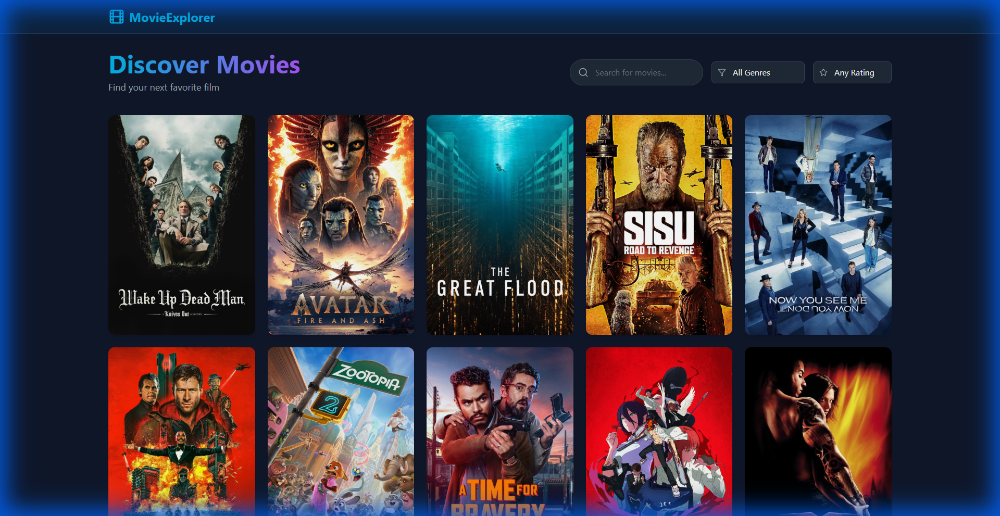

# React Movie Explorer

## Description
A premium, responsive React application that allows users to discover movies, view details, and filter by genre and rating. Built with a focus on clean UI/UX and real-time data fetching using the TMDB API.

## Tech Stack
- React (Vite)
- Tailwind CSS
- TMDB API
- React Router
- Axios
- Lucide React

## Features
- **Search & Discovery**: Real-time movie search and trending lists.
- **Advanced Filtering**: Filter movies by genre and minimum rating.
- **Infinite Scroll**: Seamlessly load more movies as you scroll.
- **Responsive Design**: Fully optimized for mobile, tablet, and desktop.
- **Dark Mode UI**: Sleek, professional dark-themed interface.

## Screenshots


## Live Demo
[View Live Demo](https://movie-explorer-one-delta.vercel.app/)

## Setup Instructions
1. Clone the repository
   ```bash
   git clone https://github.com/Govind-10090/movie-explorer.git
   ```
2. Install dependencies
   ```bash
   npm install
   ```
3. Configure API Key
   - Create a `.env` file in the root directory
   - Add your TMDB API Key: `VITE_TMDB_API_KEY=your_api_key_here`
4. Run the development server
   ```bash
   npm run dev
   ```
